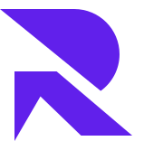

# RegNxt Frontend 🚀

<div align="center">
  
  <br />
  <br />
  
  [](https://www.typescriptlang.org/)
  [](https://reactjs.org/)
  [](https://vitejs.dev/)
  [](https://tailwindcss.com/)

  <p>RegNxt Frontend - A modern, scalable regulatory reporting platform built with React and TypeScript.</p>
</div>

## 📋 Table of Contents

- [RegNxt Frontend 🚀](#regnxt-frontend-)
  - [📋 Table of Contents](#-table-of-contents)
  - [✨ Features](#-features)
  - [🔧 Prerequisites](#-prerequisites)
  - [🚀 Getting Started](#-getting-started)
  - [📁 Project Structure](#-project-structure)
  - [💻 Development](#-development)
    - [Available Scripts](#available-scripts)
    - [Code Style](#code-style)
  - [🧪 Testing](#-testing)
  - [📦 Deployment](#-deployment)
  - [👥 Contributing](#-contributing)
    - [Development Process](#development-process)
  - [📄 License](#-license)
  - [🤝 Support](#-support)
  - [🙏 Acknowledgments](#-acknowledgments)

## ✨ Features

- 🎯 **Modern Stack**: Built with React 18, TypeScript, and Vite
- 🎨 **UI Components**: Comprehensive set of reusable components with shadcn/ui
- 📱 **Responsive Design**: Mobile-first approach using TailwindCSS (Future Release)
- 🔐 **Authentication**: Secure authentication system with JWT
- 📊 **Data Visualization**: Advanced charting capabilities with recharts
- 🌐 **API Integration**: Axios-based API client with interceptors
- 🎭 **State Management**: Efficient state handling with React hooks and context
- 🧪 **Testing**: Comprehensive testing setup with Jest and React Testing Library
- 📦 **Module Federation**: Micro-frontend architecture support

## 🔧 Prerequisites

Before you begin, ensure you have the following installed:
- Node.js (v18 or higher)
- pnpm (v8 or higher)
- jq (`brew install jq` or `sudo apt install -y jq`)

## 🚀 Getting Started

1. Clone the repository:
```bash
git clone git@github.com:RegNxt-App/RN-Frontend.git
cd rn-frontend
```

2. Install dependencies:
```bash
pnpm install
```

3. Set up environment variables:
```bash
cp .env.example .env
```

4. Start the development server:
```bash
pnpm dev
```

Visit `http://localhost:5173` to see the application.

## 📁 Project Structure

```
rn-frontend/
├── apps/
│   ├── reporting/           # Main reporting application
│   └── shared/             # Shared components and utilities
├── packages/
│   ├── ui/                 # UI component library
│   └── config/            # Shared configuration
├── public/                # Static assets
└── package.json
```

## 💻 Development

### Available Scripts

```bash
# Start development server
pnpm dev

# Build for production
pnpm build

# Run tests
pnpm test

# Run linting
pnpm lint

# Run type checking
pnpm type-check
```

### Code Style

We follow strict coding standards using:
- ESLint
- Prettier
- TypeScript strict mode

Run `pnpm lint` to check your code style.

## 🧪 Testing

We use Jest and React Testing Library for testing. Run tests with:

```bash
# Run all tests
pnpm test

# Run tests in watch mode
pnpm test:watch

# Generate coverage report
pnpm test:coverage
```

## 📦 Deployment

Build the application for production:

```bash
pnpm build
```

The build artifacts will be stored in the `dist/` directory.

## 👥 Contributing

We welcome contributions! Please see our [Contributing Guide](CONTRIBUTING.md) for details.

### Development Process

1. Fork the repository
2. Create your feature branch (`git checkout -b feature/amazing-feature`)
3. Commit your changes (`git commit -m 'feat: add amazing feature'`)
4. Push to the branch (`git push origin feature/amazing-feature`)
5. Open a Pull Request

## 📄 License

This project is licensed under the MIT License - see the [LICENSE](LICENSE) file for details.

## 🤝 Support

For support, email abdullahmujahidali1@gmail.com or join our [Slack channel](https://teams.live.com/l/community/FEAHtEmtb0jGdAARgI)

## 🙏 Acknowledgments

- Thanks to all our contributors
- Built with [shadcn/ui](https://ui.shadcn.com/)
- Icons by [Lucide](https://lucide.dev/)

---

<div align="center">
  Made with ❤️ by the RegNxt Team
</div>

